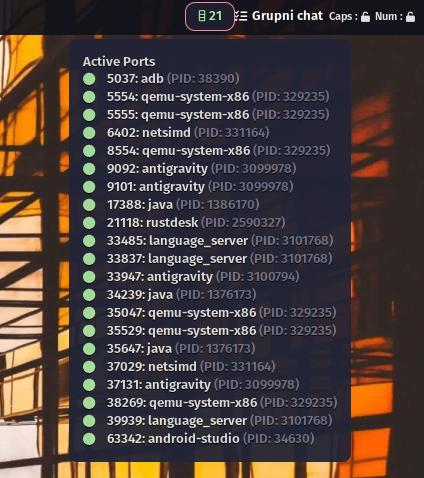

# PortKiller Pro (Linux Edition)

**PortKiller Pro** is a sophisticated, high-performance port management utility designed specifically for the modern Linux desktop. Melding the raw power of **Rust** with a breathtaking **Liquid Glass** aesthetic, it provides developers with a seamless, visual way to monitor and terminate stubborn network processes. Whether you're debugging microservices or cleaning up zombie ports, PortKiller Pro turns a tedious terminal task into a sleek, premium experience.


## ✨ Features

- **Liquid Glass UI**: Authentic frosted glass effect with adjustable transparency and blur, perfectly fitting modern desktop environments.
- **Responsive Design**: Adapts perfectly to any window size, from compact to full-screen.
- **Contextual Filtering**: Quickly sort ports by categories (Web, Database, System) or search for specific ones.
- **Direct Termination**: Kill processes instantly with a single click, no more `lsof -i :8080` followed by `kill -9`.
- **High Performance**: Powered by Rust and Tauri for a minimal resource footprint and lightning-fast responsiveness.

## 🛠️ Integrations

### Waybar Integration

PortKiller comes with built-in Waybar support, allowing you to monitor active ports directly from your status bar. The GUI includes an automated installer to get you up and running in seconds.



### Rofi Menu

A dedicated, styled Rofi menu is available for those who prefer keyboard-centric workflows. Access your ports instantly without opening the full GUI.

```bash
portkiller menu
```

## 🚀 Installation

### Using the Installer (Recommended)

Clone the repository and run the installation script:

```bash
git clone https://github.com/vaha/PortKillerLinux.git
cd PortKillerLinux
chmod +x install.sh
./install.sh
```

### Manual Installation

1. Install dependencies: `libgtk-3-dev`, `libwebkit2gtk-4.1-dev`.
2. Build with Tauri: `npm install && npx tauri build`.
3. Copy the binary from `src-tauri/target/release/portkiller` to your `~/.local/bin/`.

## 👨‍💻 Created By

**Vahid E.**

- Website: [vaha.net](https://vaha.net)
- Inspired by [productdevbook/port-killer](https://github.com/productdevbook/port-killer)

---
*Developed with ❤️ for the Linux community.*
